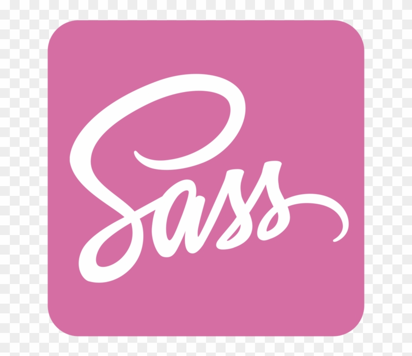

## Présentation du projet

J'ai cloné l'API Netflix de site https://www.themoviedb.org/. Ce projet me permet de créer une page d'accueil personnalisée pour afficher des films et leurs informations.

## Aperçu visuel

===========================Plus d'info=================

=========================page d'accueil==================

=========================Mobile===================

## Fonctionnalités

- Affichage aléatoire d'un poster de film dans l'en-tête à chaque rechargement de la page.
- Bouton "Lecteur" : redirige vers une page où l'utilisateur peut regarder le film sélectionné.
- Bouton "Plus d'infos" : affiche une bannière de film avec une description détaillée.
- Affichage des films dans plusieurs colonnes avec la possibilité de faire défiler la liste.

## Instructions pour l'exécution

1. Clonez ce dépôt sur votre machine locale.
2. Assurez-vous d'avoir installé les dépendances suivantes :

   - Style : SCSS 

   - API : Axios 

   - Router : react-router-dom 

     - Routes/Route
     - Link
     - useParams

3. Exécutez le projet en utilisant votre serveur de développement préféré.
4. Accédez à la page d'accueil pour commencer à explorer les films disponibles.

N'hésitez pas à contribuer en proposant des améliorations ou en signalant des problèmes.
